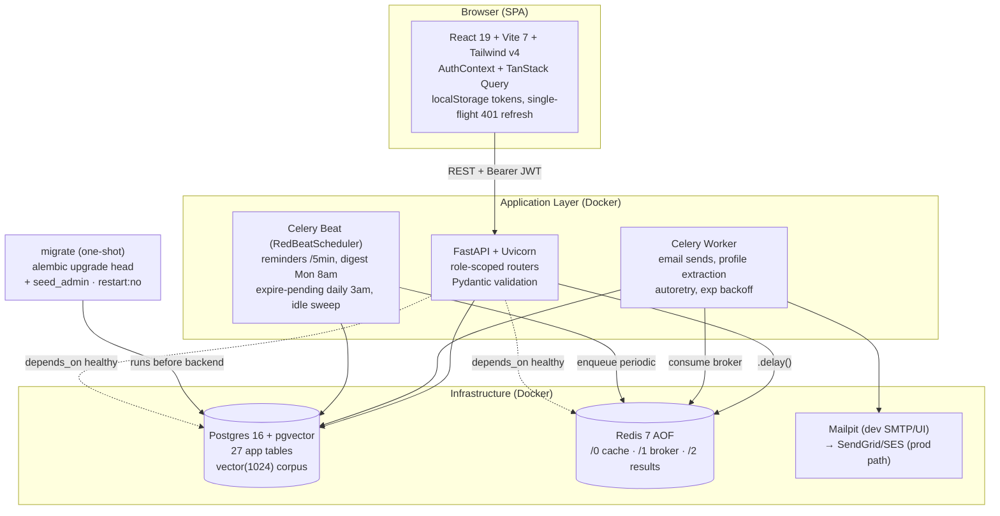
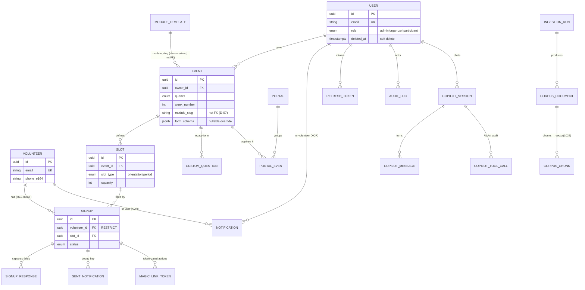
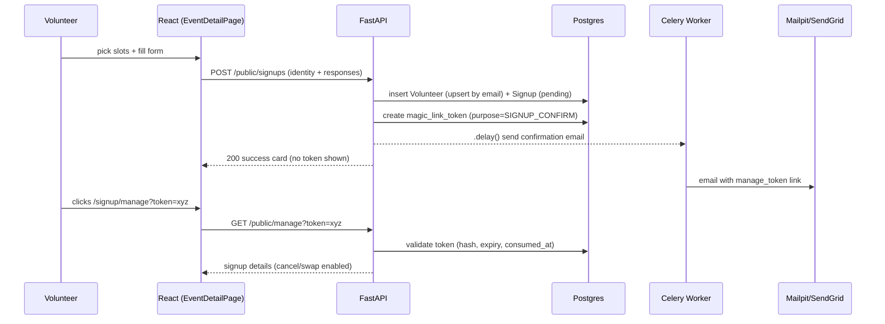
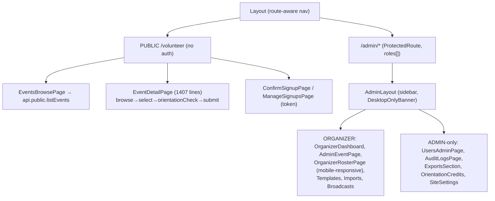
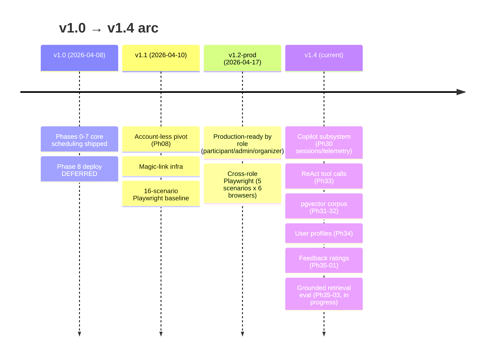

# UCSB SciTrek Volunteer Scheduler — Product & Architecture Brief

> Audience: senior architects, 15-minute review. Grounded in the real codebase as of commit `014068c` (branch `feature/v1.4-phase-35-03-grounded-eval`). Anything not built is marked **not yet built**.

---

## 1. TL;DR

- **What:** A web app that schedules university volunteers (UCSB SciTrek outreach program) into time slots across multi-week science modules, with account-less self-signup and staff management tooling.
- **Who:** Three roles — **Participants** (volunteers, no account), **Organizers** (run events + rosters), **Admins** (system-wide users, settings, analytics, audit).
- **Stack:** React 19 + Vite 7 + Tailwind v4 frontend; FastAPI + SQLAlchemy + Alembic + Postgres 16 (pgvector) backend; Celery + Redis for async/scheduled jobs; Docker Compose orchestration (6 services).
- **Status:** v1.0–v1.2 shipped (production-ready by role, cross-role Playwright coverage). Currently in **v1.4** building an AI copilot subsystem (chat sessions, ReAct tool calls, pgvector knowledge corpus, grounded retrieval eval). 27 application tables + telemetry.
- **Handoff remaining:** AWS deployment (Phase 08, deferred) → owned by **Rafael**. Latent Alembic downgrade bug deferred. SMS path (Phase 27) reserved but not wired.

---

## 2. The Product

**Problem.** SciTrek sends university volunteers into K-12 classrooms across UCSB's 11-week quarters. Coordinators needed to (a) let volunteers sign up for specific classroom slots without managing hundreds of student accounts, (b) enforce an orientation prerequisite, and (c) give staff rosters, reminders, and reporting.

**Three roles:**

| Role | Account? | Entry | Can do |
|---|---|---|---|
| **Participant (volunteer)** | No — email-keyed identity | Public `/volunteer`, magic-link tokens | Browse events, pick slots, fill per-event form, manage/cancel via emailed token link |
| **Organizer** | Yes (User, role=organizer) | `/admin/*` (desktop) | Create/duplicate events, manage rosters, check-in, CSV imports, broadcasts, templates |
| **Admin** | Yes (User, role=admin) | `/admin/*` (desktop) | All organizer powers + user management, site settings, audit logs, analytics exports |

**Account-less model (Phase 08 pivot) and why.** The schema originally tied signups to `User` accounts. Phase 08 split identity into two tables: **`Volunteer`** (email-keyed, optional phone, no password) and **`User`** (staff credentials with role). Signups now FK to `Volunteer`. Rationale: volunteers are ephemeral and high-churn; forcing account creation killed conversion. They authenticate per-action via **magic-link tokens** emailed to them. Staff keep real login accounts.

**Week-based scheduling and why.** UCSB runs on **11-week quarters, not yearly cycles**. `Event` carries `quarter` (winter/spring/summer/fall), `year`, `week_number`, and `school`. Organizers think in weeks; the CSV module-template import runs **once per quarter (every 11 weeks)**, not yearly. Orientation is a **soft warning**, not a hard block — eligibility nudges, it does not forbid.

---

## 3. System Architecture

**Annotations:**
- **migrate** runs once and exits (`restart: "no"`); backend waits on it. Schema is a hard prerequisite, kept out of app startup.
- **Redis is split** by DB index: cache `/0`, Celery broker `/1`, result backend `/2`.
- **Beat uses RedBeatScheduler** (schedule persisted in Redis) so beat restarts and multiple instances don't double-fire.
- **Postgres + Redis are NOT exposed to localhost** in dev — only reachable inside the `uni-volunteer-scheduler_default` network (forces dev/CI parity).

---

## 4. Data Model

27 application tables + `alembic_version`. Below is the core lifecycle and the major subsystems (copilot/corpus simplified).

**Key entities:**

| Table | Purpose |
|---|---|
| `volunteers` | Central account-less identity, email-keyed (Phase 08) |
| `users` | Staff credentials + role; soft-deletable |
| `events` / `slots` | Week-based events; slots are the bookable units (orientation vs period) |
| `signups` | The join of volunteer→slot; **immutable** (RESTRICT) — source of truth for hours/credit |
| `module_templates` | Reusable module defs; `family_key` groups related modules; `default_form_schema` |
| `orientation_credits` | (email, family_key) credit, from attendance or explicit grant — **outlives volunteer rows** |
| `signup_responses` | Per-form-field answers (Phase 22, replaces `custom_answers`) |
| `notifications` / `sent_notifications` | Recipient XOR (user/volunteer); dedup for exactly-once email |
| `magic_link_tokens` | Token-gated participant actions (confirm/manage/check-in) |
| `copilot_*` (sessions/messages/tool_calls/ratings/user_profiles) | v1.4 AI assistant + telemetry + feedback |
| `ingestion_runs` / `corpus_documents` / `corpus_chunks` | pgvector knowledge corpus, paper-grade reproducible ingestion |
| `audit_logs`, `refresh_tokens`, `site_settings`, `portals`, `csv_imports`, `volunteer_preferences` | Auxiliary |

All timestamps are **TIMESTAMPTZ**. PKs are UUID except `module_templates` (slug), `site_settings` (id=1 singleton), `copilot_tool_calls` (BIGINT), `volunteer_preferences`/`copilot_user_profiles` (string/email keyed).

---

## 5. API Surface

Route groups exposed by the FastAPI client namespaces (`api.*`):

| Group | Purpose | Auth |
|---|---|---|
| `api.public.*` | Browse events, get form schema, orientation check, create/confirm/manage signup | **None** — token-gated via magic link (`auth: false`) |
| `api.events.*` | Organizer event listing/management | Bearer JWT, role=organizer/admin |
| `api.admin.*` | Users, summary, audit logs, analytics exports, templates, site settings | Bearer JWT, role-scoped (some admin-only) |
| `api.organizer.*` | Roster, check-in, broadcasts | Bearer JWT, role=organizer/admin |
| `api.portals.*` | Portal grouping / public tabs | Mixed (public read) |
| `/auth/*` | login, refresh, me | Public login → issues JWT pair |

**Magic-link auth (participant) — no account:**

> Staff auth is separate: email/password → `/auth/login` → access + refresh JWT in localStorage; **single-flight** `/auth/refresh` on 401 (concurrent 401s await one refresh promise).

---

## 6. Frontend / UI Architecture

Role-stratified SPA. Three route trees, one shared `Layout` that switches nav by pathname.

- **State:** `AuthContext` (user/role/login/logout) + **TanStack Query** for all server data (`retry:1`, no refetch-on-focus). No Redux/Zustand/form libraries — `useState` for forms, server-side Pydantic is authoritative.
- **Pillars:** Public is account-less and token-gated; organizer and admin share `AdminLayout` but `ProtectedRoute` + nav filtering enforce role boundaries (e.g. `/admin/users` is admin-only).
- **Design system:** 14 atomic `ui/` components + 12 `admin/` composites; Tailwind v4 CSS variables; WCAG-AA avatar colors. Timezone hard-coded `America/Los_Angeles` (single venue).
- **Desktop enforcement:** `/admin/*` shows `DesktopOnlyBanner` below md; only `OrganizerRosterPage` is fully mobile-responsive (used at check-in).

---

## 7. Key Design Decisions & Trade-offs

| Decision | Why | Trade-off / What we gave up |
|---|---|---|
| **Account-less Volunteer split from User** (Ph08) | Zero-friction signup; volunteers are ephemeral | Two identity tables; email is the join key everywhere; no volunteer login session |
| **Signup.volunteer_id RESTRICT (not CASCADE)** (Ph08 D-01) | Attendance is the source of truth for hours/credit | Can't delete a volunteer until signups cancelled; manual cleanup workflow |
| **module_slug as plain String, not FK** (Ph08 D-07) | Denormalized label; unblocks independent Event/Template evolution | No referential integrity on module reference; possible orphan slugs |
| **OrientationCredit keyed by (email, family_key), no FK** (Ph21) | Credit/consent must outlive volunteer rows across delete cycles | No DB-enforced link to a volunteer row; relies on email stability |
| **family_key grouping (backfilled = slug)** (Ph21) | Credit once for a module family (intro+advanced) | Extra denormalized column; mapping is convention, not enforced |
| **Notification recipient XOR CHECK** (Ph09 D-04) | Exactly one recipient type, enforced at DB layer | Two nullable FKs + a CHECK rather than two tables |
| **SentNotification UNIQUE(signup_id,kind) + ON CONFLICT** (Ph06) | Exactly-once email on Celery retries | Pre-insert before send; dedup logic lives in task, not framework |
| **Event.form_schema override / Template default** (Ph22) | Per-event form customization without editing templates | Two schema sources; null-fallback logic on read |
| **SignupResponse replaces CustomAnswer** (Ph22) | Per-field upsert + structured `value_json` | Legacy `custom_answers`/`custom_questions` still present (parallel path) |
| **CorpusChunk fixed Vector(1024) + provider filter** (Ph31/32) | Avoid HNSW rebuild on model swap; never cosine across embedding spaces | Wastes space when padding BGE (smaller dim) to 1024 |
| **IngestionRun audit, never backfill** (Ph31) | Reproducible embeddings tied to git commit + provider + chunker | Every CLI run writes a row; no historical reconstruction |
| **CopilotUserProfile one-per-user, no history** (Ph34) | Cheap cross-session memory, no JOIN per message | Loses profile evolution; version counter is the only trace |
| **Copilot telemetry columns nullable (assistant-only)** (Ph30) | Honest schema — user/system rows have no LLM metrics | Readers must null-check; can't assume per-row token counts |
| **localStorage JWT (not httpOnly cookie)** | CORS control, intercept 401s, custom refresh | XSS-exposed tokens; mitigated by short-lived access + refresh rotation |
| **Single-flight 401 refresh (module-scoped promise)** | N concurrent 401s queue behind one refresh | Module-global state; must reset promise in `finally` |
| **EventDetailPage as one 1407-line component** | Self-contained one-time signup flow; per-feature tests | Hard to read/reuse; large single file |
| **TanStack Query over Redux/SWR** | Mutation handling, refetch control, devtools | New mental model vs. global store; query-key discipline required |
| **No form library** | Inline validation simpler for the flows we have | Reinvents validation; no schema-driven forms |
| **Desktop-only admin (DesktopOnlyBanner)** | Admin needs 1280px+ layouts | No admin mobile UX (roster page excepted) |
| **Postgres/Redis not exposed to localhost** | Dev/CI parity; no test-data bleed | Devs must run pytest in a one-off container on the docker network |
| **One-shot migrate service (restart:no)** | Schema is a prerequisite, ordered by depends_on | Two-step deploy (run migrate, then up backend) |
| **RedBeatScheduler (Redis-backed beat)** | Resilient to restarts; multi-beat without double-fire | Redis is now a scheduling dependency, not just a broker |
| **Alembic slug revision IDs + VARCHAR(128) widen on startup** | Human-readable migration history | Default VARCHAR(32) overflows; env.py widens on every boot (small cost) |
| **Transactional test session w/ savepoints** | Tests exercise real `db.commit()` paths; fast rollback | Savepoint nesting subtlety; not identical to fresh-DB isolation |
| **6-project Playwright matrix** | Catch mobile/webkit-specific regressions | Slower CI; 2x retries for transient flakiness |

---

## 8. Project Timeline / Milestones

| Milestone | Date | Shipped |
|---|---|---|
| v1.0 | 2026-04-08 | Phases 0–7: events, slots, signups, check-in, module templates, reminders, soft-delete |
| v1.1 | 2026-04-10 | Phase 08 account-less realignment; magic links; Playwright baseline |
| v1.2-prod | 2026-04-17 | Phases 14–20: production-ready participant/admin/organizer + cross-role integration |
| v1.4 | in progress | Phases 30–35: AI copilot, ReAct audit, pgvector knowledge corpus, eval harness |

**Remaining until handoff to Rafael (AWS deploy):**
- **Phase 08 deployment** is still deferred — this is Rafael's target. App is containerized (Docker Compose) but not deployed to AWS; prod email path (SendGrid/SES) selectable via `config.email_mode` but unprovisioned.
- Resolve or accept the **Alembic downgrade DROP TYPE** latent bug.
- Decide on **SMS** (Phase 27, reserved columns only — **not yet built**).

---

## 9. Anticipated Questions (Q&A)

### Architecture
| Q | A |
|---|---|
| Why three route trees instead of one RBAC UI? | Account-less ephemeral participants vs. persistent staff are fundamentally different UX paradigms; separate paths cut branching complexity. Public/`/admin` split in `App.jsx`. |
| Why is `EventDetailPage` 1407 lines? | It owns the whole one-time signup flow (browse→select→orientation→form→submit→success). Splitting would force state lifting + ref forwarding for a self-contained flow; tests are per-feature. |
| Why TanStack Query over Redux/Zustand? | Server-state problem, not client-state. Mutations, refetch control, dedup, devtools out of the box. Auth (small, sync) stays in Context. |
| Why localStorage tokens not httpOnly cookies? | Full control of refresh + 401 intercept across CORS origins. Accepted XSS exposure, mitigated by short access tokens + rotating refresh tokens. |
| How does concurrent 401 refresh avoid a thundering herd? | A module-scoped `refreshPromise` caches the in-flight `/auth/refresh`; all concurrent 401s await the same promise, reset in `finally`. |
| Why does Layout switch nav by pathname not role? | One shared Layout across all surfaces; pathname detection (`/admin/*`, `/volunteer/*`) avoids three layout components. |

### Data
| Q | A |
|---|---|
| Why split Volunteer and User instead of a flag? | Volunteers self-register with no password (magic-link only); Users are staff with credentials + role. Separate tables enforce the boundary at schema level (Ph08 D-01). |
| Why Signup RESTRICT not CASCADE? | Attendance history drives orientation credit + hours. CASCADE would silently destroy the audit trail; RESTRICT forces explicit cancel-then-delete. |
| Why is module_slug a String, not FK? | Ph08 D-07: it's a denormalized display label, not structural. Dropping the FK unblocked Phase 09–18 schema growth. |
| Why is OrientationCredit keyed by email, not a Volunteer FK? | Credits/consents must outlive volunteer rows through soft/hard delete cycles; email is the stable identity. Mirrors VolunteerPreference. |
| How does family_key orientation work? | Modules in a family (e.g. CRISPR-intro + advanced) share `family_key`. A volunteer with ANY attended orientation slot in that family satisfies the requirement. |
| Event.form_schema vs Template.default_form_schema? | Template default is never null; Event override is nullable. Read = event override if present, else template default. |
| Why nullable copilot telemetry columns? | Only assistant rows come from an LLM; user/system rows have no latency/tokens. Nullable = honest schema, no misleading nulls in evals. |
| Why fixed Vector(1024)? | Jina v3 native dim; BGE padded to 1024. Locks the dimension so swapping embedding models doesn't force an HNSW index rebuild. |
| Why does retrieval filter by embedding_provider? | Never compute cosine across embedding spaces trained on different tokenizers/corpora — that's a silent semantic-search bug (RESEARCH Pitfall 4). |
| Why so much IngestionRun telemetry? | Paper-grade reproducibility: every embedding ties to git commit + provider + chunker version. Never backfill or the chain breaks. |

### Security / Auth
| Q | A |
|---|---|
| How do participants act without an account? | Magic-link tokens. Signup emails a `manage_token`; clicking it hits `/signup/manage?token=`; server validates hash/expiry/consumed_at. Token scope gates cancel/swap. |
| What stops magic-link replay? | Tokens are hashed, time-boxed (`expires_at`), and single-use (`consumed_at`). Rate-limited per email/hour (bypassed only under `EXPOSE_TOKENS_FOR_TESTING`). |
| How are notification recipients constrained? | DB CHECK constraint: exactly one of `user_id`/`volunteer_id` is non-null — never both, never neither. |
| Can an organizer reach admin pages? | No. `ProtectedRoute roles={['admin']}` blocks `/admin/users`; nav filtering hides the link. Server endpoints are role-scoped too. |
| Where is broadcast abuse handled? | Rate-limited; 429 returns `Retry-After` (Phase 26). |
| Are UUIDs leaked in audit UI? | No — audit feed is humanized (D-19), relative timestamps, no UUIDs in DOM. |

### Scaling / Reliability
| Q | A |
|---|---|
| How is exactly-once email guaranteed? | `sent_notifications(signup_id, kind)` UNIQUE + INSERT ON CONFLICT DO NOTHING. First insert wins and enqueues; conflict = already sent. |
| What if beat double-fires from clock skew? | Idempotent at the dedup table inside `send_reminders_24h`; the second insert returns 0 rows and skips enqueue. |
| How do Celery tasks recover from transient failure? | `autoretry_for=(Exception,)`, `retry_backoff=True`, `retry_backoff_max=600`, jitter, `max_retries=3`. Persistent failures surface in logs. |
| Why RedBeatScheduler? | Schedule persists in Redis → resilient to beat restarts, multiple beat instances won't duplicate-fire. |
| What's the slot-fills-during-signup race? | Backend returns 409; frontend invalidates `['publicEvent', id]`, returns to browse, toasts "slots now full." |
| Single biggest scaling risk today? | Not yet deployed/load-tested on AWS; single venue, single timezone. Vertical Postgres + one worker pool is fine for current SciTrek volume. |

### Testing
| Q | A |
|---|---|
| Why run pytest in a docker container, not localhost? | db/redis aren't exposed to localhost (dev/CI parity, no data bleed). Tests run in a one-off container on `uni-volunteer-scheduler_default` with `TEST_DATABASE_URL=db:5432`. |
| How is test isolation done without per-test DBs? | Outer transaction + SAVEPOINT; router `db.commit()` restarts the savepoint, teardown rolls back the outer txn. Fast, deterministic, no manual cleanup. |
| How does Celery behave in tests? | Eager mode: `task_always_eager=True` (synchronous), `task_eager_propagates=False` (swallows email errors so missing keys don't break runs). |
| What does E2E cover? | Playwright across 6 projects (chromium/firefox/webkit + 3 mobile). Cross-role: public signup, organizer check-in, admin audit. Seeded via HTTP `seed_e2e.py` in globalSetup. |
| Coverage gates? | Global floor 55%; critical paths (`signup_service.py`, `routers/signups.py`, `celery_app.py`) 100%; copilot/corpus 95%. Enforced by a custom script over `coverage.json`. |
| Why seed E2E over HTTP not raw SQL? | Seed logic matches real app behavior (migrations, audit logs, triggers); idempotent upsert; IDs returned as JSON for Playwright. |

### Product
| Q | A |
|---|---|
| Why is orientation a soft warning not a hard block? | SciTrek policy — nudge, don't forbid. Frontend shows a confirm modal if no credit; signup still proceeds. |
| Why week/quarter columns on events? | UCSB runs 11-week quarters; organizers schedule by week. CSV module import is quarterly, not yearly. |
| What's the copilot for? | v1.4 AI assistant over the app's own knowledge corpus (docs/code/migrations) via pgvector retrieval, with ReAct tool calls audited and rated for eval. |
| Is SMS live? | **Not yet built.** Columns (`sms_opt_in`, `phone_e164`) reserved for Phase 27 (AWS SNS); a local-only test number exists but is uncommitted. |

---

## 10. Known Gaps & Honest Risks

- **Alembic downgrade DROP TYPE leak (latent bug, documented in CLAUDE.md):** several Phase 00–06 migrations create enum types in `upgrade()` but don't `DROP TYPE` in `downgrade()`. Fresh upgrades work; **downgrade→upgrade round-trips fail with `DuplicateObject`**. Accepted because downgrade is dev-only. Cleanup deferred.
- **Not deployed (Phase 08 deferred):** containerized but no AWS. Prod email (SendGrid/SES) selectable but unprovisioned. This is **Rafael's handoff target**.
- **SMS not built (Phase 27):** schema columns reserved only; no SNS wiring.
- **Legacy form path coexists:** `custom_questions`/`custom_answers` (legacy) live alongside `signup_responses` (Phase 22). Two paths until legacy is retired.
- **module_slug has no referential integrity** (intentional D-07) — orphan/typo slugs possible.
- **EventDetailPage is a 1407-line monolith** — maintenance/readability risk, accepted for a one-time flow.
- **localStorage tokens are XSS-exposed** — mitigated, not eliminated.
- **No load testing yet** — volume assumptions (single program, single venue) untested at scale.
- **alembic_version widening runs on every startup** — small recurring SQL cost; removing it breaks long slug IDs.

---

## How to present this in 15 minutes

- **0:00–1:00 — Opener (Section 1).** "Account-less volunteer scheduler for UCSB's quarter-based outreach. Three roles, React + FastAPI + Postgres/pgvector, Celery for async. v1.2 in prod by role; v1.4 adds an AI copilot. Remaining: AWS deploy, owned by Rafael."
- **1:00–3:00 — The Product (Section 2).** Roles table + the two "why" stories: account-less (conversion) and week-based (UCSB quarters). Stress orientation is a *soft* warning.
- **3:00–6:00 — Architecture (Section 3).** Walk the runtime flowchart. Hit: one-shot migrate, Redis split, RedBeat, network isolation.
- **6:00–9:00 — Data Model (Section 4).** Show ER diagram; tell the Phase 08 pivot story (Volunteer/User split, RESTRICT, email-keyed credit). This is the design spine.
- **9:00–11:00 — Decisions & Trade-offs (Section 7).** Don't read the table — pick 3: account-less split, RESTRICT vs CASCADE, exactly-once email dedup. State the trade-off out loud each time.
- **11:00–13:00 — Auth + Testing.** Magic-link sequence diagram (Section 5); then savepoint isolation + dedup idempotency (Section 9 Testing/Scaling).
- **13:00–14:00 — Gaps (Section 10).** Lead with the Alembic downgrade bug and "not deployed yet." Candor disarms gotchas.
- **14:00–15:00 — Close.** "v1.2 shipped by role with cross-role E2E; v1.4 copilot in progress; clean handoff to Rafael for AWS." Take questions from the Q&A bank.
